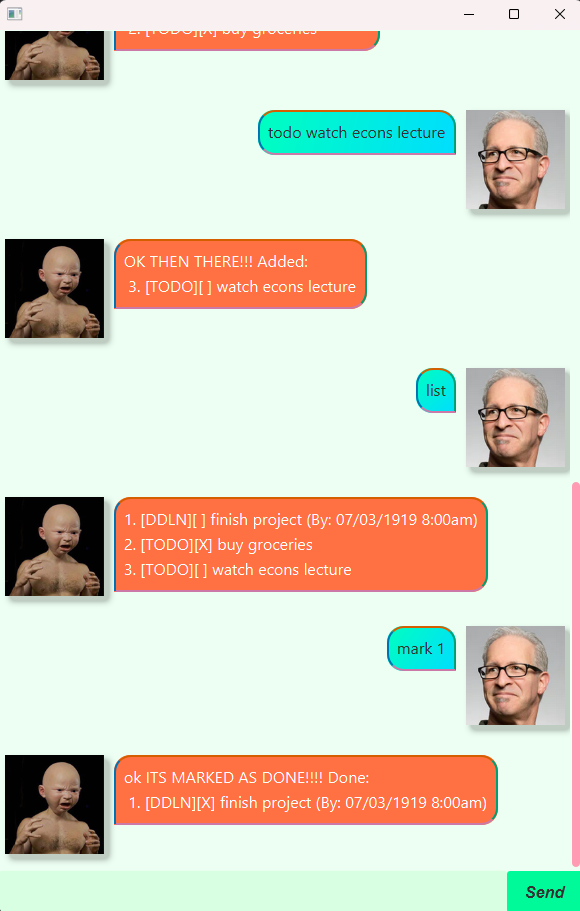

# LittleBabyMan User Guide



LittleBabyMan is an easy-to-use tool for managing your tasks 
and projects efficiently. With a user-friendly interface, 
powerful features and a FIESTY personality, it helps you stay 
organized, productive and motivated.


## ❗**IMPORTANT** Time formats
All Date and Time inputs should be in the following format:
`dd-MM-yyyy HHmm`<br>
Dates & Months should be 2 digits long. Years should be 4 digits long.
Time should be in 24 hour format and 4 digits long.
Example: `20-05-2025 0800` represents `20th May 2025, 8:00am`

## See all commands 

Type the `help` command in the command line for more
details about commands and their formats.

## Adding Todo Tasks

You can add todos using the `todo` keyword followed by the task.

Example:
```
todo buy groceries
```

Expected output:

```
OK THEN THERE!!! Added:
 1. [TODO][ ] buy groceries
```

## Adding Deadline Tasks

You can add deadlines using the `deadline` keyword
followed by the task and the date.

Example: 
```
deadline work /by 20-05-2025 0800
```

Expected output:

```
YOU BETTER DO IT IN TIME!!!!!!! Added: 
 1. [DDLN][ ] work (By: 20/05/2025 8:00am)
```

## Adding Event Tasks

You can add events using the `event` keyword followed by the task and the event start time and end time.

Example:
```
event go beach /from 20-10-1919 0729 /to 20-10-1919 1800
```

Expected output:

```
BE THERE OR ELSE!!!!! Added:
 1. [EVNT][ ] go beach (From: 20/10/1919 7:29am, To: 20/10/1919 6:00pm) 
```

## Marking and unmarking tasks as done

You can mark a task as done using the `mark` keyword followed by the task number.
You can unmark a task using the `unmark` keyword followed by the task number.

Examples:
```
mark 1
```
```
unmark 1
```

Expected outputs:
```
"ok ITS MARKED AS DONE!!!! Done:
 1. [TODO][X] buy groceries
```
```
WHY'D YOU UNMARK IT?!?! Not Done:
 1. [TODO][ ] buy groceries
```

## Deleting tasks

You can delete a task using the `delete` keyword followed by the task number.

Example:
```
delete 1
```
Expected output:
```
ok ITS GONE:
 1. Deleted: [TODO][X] buy groceries
```

## See all tasks

You can see all your tasks using the `list` keyword.
Example:
```
list
```
Expected output:
```
1. [TODO][ ] buy groceries
2. [DDLN][ ] work (By: 20/05/2025 8:00am)
3. [EVNT][ ] go beach (From: 20/10/1919 7:29am, To: 20/10/1919 6:00pm)
```

## Finding tasks
You can find tasks using the `find` keyword followed by the keyword you want to search for.
Example:
```
find beach
```
Expected output:
```
Here are the matching tasks in your list:
1. [EVNT][ ] go beach (From: 20/10/1919 7:29am, To: 20/10/1919 6:00pm)
``` 
## Exiting the program
You can exit the program using the `bye` keyword.
Example:
```
bye
```
Expected output:
`Exits the application window.`